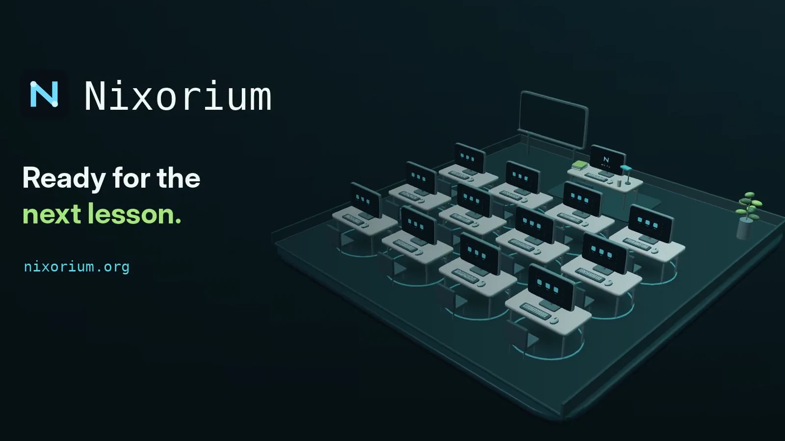

# Nixorium

Nixorium manages a room of Linux PCs like one machine.

One PC in the room, the controller, keeps a single description of the lab:
computers, accounts, software and the student desktop. It installs and updates
every student PC over the local network, without direct Internet access on the
students' side. Each PC then starts from its own disk, runs its applications
locally and returns to a clean desktop at every boot.

[](https://nixorium.org/)

[Website and one-minute video](https://nixorium.org/) ·
[Documentation](#documentation) ·
[Contributing](CONTRIBUTING.md) ·
[Sponsor](https://github.com/sponsors/giovantenne) ·
[Releases](https://github.com/giovantenne/nixorium/releases)

## Project status

Nixorium has run the Italian school lab where it began, 30 student PCs and a
controller, for two years, and other labs use it too. The
[original classroom account](https://nixorium.org/case-study/original-classroom/)
tells that story. It is open source under the MIT license and maintained by a
teacher; support happens in
[GitHub Discussions](https://github.com/giovantenne/nixorium/discussions).
Each release is validated on virtual machines; physical hardware differs, so
start with one controller and one client of your own.

## What it does

**For teachers**

- Every student PC starts with the same clean desktop and applications at every
  boot. The last five sessions stay on that PC as snapshots, so a lost file can
  be recovered from **Snapshots** in the Files sidebar.
- Veyon is ready with every PC of the room: watch screens, help one student,
  lock screens or show your own screen.
- A classroom dashboard on the controller shows which PCs are on, pauses or
  restores Internet on selected PCs, and shuts them down or restarts them.
  It cannot change the lab.

**For technicians**

- Add software or change the student desktop once, then update one PC, a group
  or the whole room. Every change is reviewed before it runs.
- Install PCs from the network, beside the school's existing DHCP server, or
  from a USB stick. A disk is erased only after an explicit confirmation.
- Only the controller needs Internet: it serves systems and updates to the PCs
  from a local, signed cache.
- Update Nixorium and the system separately, when you choose, and go back to a
  previous system version if an update causes trouble.
- When something is interrupted, Nixorium lists it and says what to do next. An
  encrypted controller backup lets a new controller take over without
  reinstalling the PCs.
- Software choices, desktop defaults and local policy live in your own private
  repository, separate from this framework.

Under the hood: NixOS builds every PC from the same description, Colmena
deploys it, Harmonia serves the cache and Disko lays out the disks.

## What you need

Two 64-bit PCs with UEFI that you can erase (or two virtual machines), a USB
stick with the official [NixOS Minimal ISO](https://nixos.org/download/#nixos-iso),
Internet on the controller, and a network where the two PCs reach each other.
Installation erases the disk you confirm on each PC: back up anything you need
first.

Network installation also needs UEFI network boot on the clients and permission
to run ProxyDHCP beside the existing DHCP server; Wi-Fi may not support it,
and USB over SSH works without it. The
[administrator guide](templates/site/README.md#first-setup) lists the network,
storage and console requirements in full.

## Quick start

Verify **one client** before preparing the rest of the room. For a disposable
trial on virtual machines, follow the
[evaluation environment](docs/evaluation-environment.md).

1. **Install the controller.** Boot the NixOS Minimal ISO in UEFI mode with
   Internet access and run, in its text console:

   ```sh
   curl -fsSL https://nixorium.org/install.sh | bash
   ```

   The [bootstrap script](install.sh) asks for the keyboard layout first, then
   the time zone, accounts, passwords, an initial software profile and the
   disk, which it erases only after you type `ERASE`. Use the Minimal ISO
   console, not a terminal inside a graphical ISO.

2. **Configure the lab.** Reboot, sign in as `admin` and open **Nixorium** from
   the dock (or run `nixorium`). In **Installation**, choose **Network boot
   (PXE)** or **USB over SSH**; the first time, the guided flow asks for the
   laboratory settings, creates the keys, activates the controller and
   prepares the clients.

3. **Install the first client.** With network boot, start the client from the
   network; the installer opens on its screen, asks which configured computer
   it is and erases the disk after you type `ERASE`. With USB over SSH, boot
   the client from the Minimal ISO and follow the controller, which checks the
   client's fingerprint before using any password. Both procedures are in the
   administrator guide: [network boot](templates/site/README.md#install-computers-with-pxe)
   and [USB over SSH](templates/site/README.md#install-one-computer-from-usb-over-ssh).

4. **Check it, then expand.** Start the client from its disk, try the student
   session, a reboot and an update from **Computers → Update computers**. Make
   the first backup from **Maintenance → Back up the controller** and keep it
   away from the controller. Then install the other PCs.

## Using Nixorium

The administrator menu has four areas:

| Area | What it is for |
|---|---|
| **Computers** | Inventory, updating computers, temporary Internet access and power controls |
| **Installation** | Laboratory settings, network boot and USB over SSH |
| **Software** | Packages and where they apply (every PC, the controller, all clients, a group or single PCs), search, suggestions and profiles |
| **Maintenance** | Settings and the student workspace, diagnostics, updates, logs, the controller backup and advanced tools |

Teachers sign in to the controller with their own account and open the
restricted classroom dashboard from the same **Nixorium** icon.

## Security

Privileged operations run through fixed system services, never as arbitrary
commands from the interface. Clients accept SSH and Veyon only from the
controller's address on the lab network. Installation always needs an explicit
confirmation; unattended installation is disabled. Private keys stay out of Git
and the Nix store. See the [management architecture](docs/management-architecture.md)
and the [security policy](SECURITY.md).

## Documentation

**Run a lab**

- [Administrator guide](templates/site/README.md): setup, daily operation and customization
- [Troubleshooting](docs/troubleshooting.md): failures, recovery and [backups](docs/troubleshooting.md#backups-and-restoration)
- [Update guide](docs/updates.md): Nixorium, NixOS and package updates
- [Management interface](docs/tui-gallery.md) and [support reports](docs/support-report.md)
- [Template reset](docs/deployment-template-reset.md) for an outdated deployment
- [Operational disclaimer](DISCLAIMER.md) and [hardware validation plan](docs/hardware-validation.md)

**Customize and extend**

- [System and extension reference](docs/system-reference.md): `lib.mkLab`, software profiles and the [student workspace](docs/system-reference.md#workspace-preparation)
- [Desktop profile](docs/desktop-profile.md)
- [Management architecture](docs/management-architecture.md) and [decision records](docs/adr/)

**Contribute**

- [Contributor guide](CONTRIBUTING.md), [agent instructions](AGENTS.md) and [development validation](docs/development-validation.md)
- [Changelog](CHANGELOG.md) and [security policy](SECURITY.md)

## Agent skills

Nixorium ships instructions that help coding agents follow its configuration,
validation and safety rules:
[`nixorium-maintainer`](skills/nixorium-maintainer/SKILL.md) for a lab's private
repository (it is also included in the deployment template) and
[`nixorium-developer`](skills/nixorium-developer/SKILL.md) for this one.
Discovery links are included for Codex, OpenCode, Claude Code and Pi; for
example, ask: “Use nixorium-maintainer to add Firefox for all computers and
validate the configuration without deploying.” Skills guide an agent; they do
not replace your review or authorize installing, deploying, committing or
pushing.

## Development

Work on the public framework here and keep site-specific changes in a private
repository. Read [CONTRIBUTING.md](CONTRIBUTING.md) and [AGENTS.md](AGENTS.md)
first.

| Area | Responsibility |
|---|---|
| `flake.nix`, `lib/`, `modules/`, `pkgs/` | Public `lib.mkLab` API, settings validation, generated hosts, NixOS modules and packaging |
| `cmd/`, `internal/` | Go CLI/TUI, workers, application workflows, domain rules and system adapters |
| `install.sh`, `setup.sh`, `scripts/` | Controller bootstrap, client installation and validation entry points |
| `templates/site/` | Template for a lab's private repository |
| `docs/`, `tests/`, `.github/` | References, tests, CI and release automation |

Run the fast validation gate with `./scripts/validate.sh --quick`, and add
`--eval` for Nix API or host-composition changes. For repeated Go edits:

```sh
nix --extra-experimental-features 'nix-command flakes' \
  develop --file tests/source-checks.nix go-shell
go test ./...
```

The [validation guide](docs/development-validation.md) says when VM tests or
the full release gate are needed.

## Support the project

If Nixorium helps your school or organization, you can support it through
[GitHub Sponsors](https://github.com/sponsors/giovantenne). Sponsorship covers
infrastructure, test hardware, documentation and maintainer time; it does not
change the license or grant privileged access to releases or decisions.

## License

Released under the [MIT License](LICENSE).
